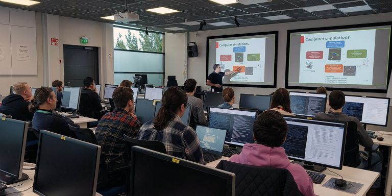
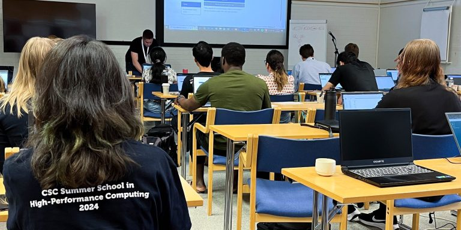

# LUMI AIF Learning Template
This is the official template for creating clean, branded self-learning course sites. By using this template, you ensure that your training materials match the **LUMI AI Factory** visual identity automatically.

For a quick overview of the Markdown syntax elements refer to [Markdown Cheat Sheet](https://www.markdownguide.org/cheat-sheet/).

---

## 📄 Add more pages
1. **Create a new page:** `index.md` is the 'landing page' of the website, do not rename it. You can easily add more pages by making new `.md` files in the root or in a subfolder. To remove chapter1 page, simply delete `chapter1.md`.
2. **Add front matter:** Every page needs these lines at the top:

```yaml
---
layout: home
title: Home page
nav_order: 1
---
```

Where: 
- `layout` should be 'home' for `index.md` and 'default' for other pages;
- `title` is the name of the page;
- `nav_order` defines the order in which the extra pages are listed on the left side.

## 🎨 Branded Boxes
You can use special "Callout Boxes" to highlight information for your students as follows:

{: .note }
> **LUMI Purple (Note)**
>
> Use this for additional context or general helpful information.

{: .warning }
> **LUMI Magenta (Warning)**
>
> Use this for critical warnings, security notices, or common errors to avoid.

Make sure to leave an empty line before and after the callout box.

---

## 💻 Technical Content
* **Links:** Links will turn Purple when you hover over them.
* **Inline Commands:** Use backticks to show code like `srun --pty bash`.
* **Code blocks** Use triple backticks to show multiline blocks of code. When user hovers over it, the copy button appears. You must have an empty line before and after the block as such: 

```python
import math

result = math.sqrt(25)
print(f"The calculation result is: {result}")
```

---

## Embedding a picture
To add an image, place it in `assets/images/` and use this syntax:



To add an image with a caption underneath and/or resize the image use this simple HTML:
<figure style="text-align: left;">
  
  <figcaption><i>Figure 1: Spring School on Computational Chemistry 2024.</i></figcaption>
</figure>

---

## Embedding a YouTube video
To add a video, simply copy the **Embed code** from YouTube (Share > Embed) and paste it into the `.md` file.

<iframe width="560" height="315" src="https://www.youtube.com/embed/aLae9Sd2oos?si=uJ_6ccR3ArrpVXqT" title="YouTube video player" frameborder="0" allow="accelerometer; autoplay; clipboard-write; encrypted-media; gyroscope; picture-in-picture; web-share" referrerpolicy="strict-origin-when-cross-origin" allowfullscreen></iframe>

---

## Tables
To add a table:

| Nodes  | CPUs             | CPU cores  | Memory  |
|:-------|:-----------------|:-----------|:--------|
| 1888   | 2x AMD EPYC 7763 | 128 (2x64) | 256 GiB |
| 128    | 2x AMD EPYC 7763 | 128 (2x64) | 512 GiB |
| 32     | 2x AMD EPYC 7763 | 128 (2x64) | 1024 GiB|

Make sure to leave an empty line before and after the table.

---

## 🧪 Mathematical Formulas
You can write beautiful LaTeX formulas easily using [MathJax](https://just-the-docs.github.io/just-the-docs-tests/components/math/mathjax/tests/):

- **Inline math:** $$\nabla \times \mathbf{E} = -\frac{\partial \mathbf{B}}{\partial t}$$
- **Block math:** 

$$
\nabla \times \mathbf{E} = -\frac{\partial \mathbf{B}}{\partial t}
$$

---

## 🛠️ Need Help?
If you have questions or suggestions on how to improve the template or instructions, please reach out to me on RocketChat: Artúr Vojt-Antal
